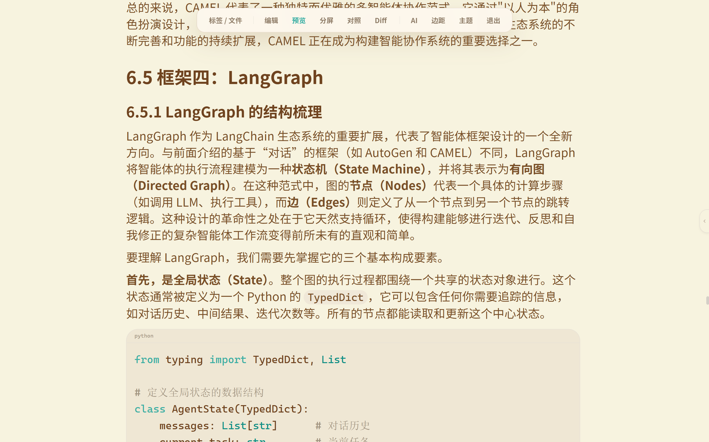

<p align="center">
  
</p>

<h1 align="center">观墨 · GuanMo</h1>

<p align="center">
  <strong>让 Markdown 文档更易阅读、更易理解、更易创作</strong><br/>
  <sub>A Markdown workspace for better reading, understanding, and writing</sub>
</p>

<p align="center">
  
  
  
  
  
</p>

## 📥 下载 · Download

<table align="center">
  <tr>
    <td><b>🪟 Windows</b></td>
    <td>
      <a href="https://github.com/we-used-to-be/Guanmo-open/releases/latest"><b>⬇ 下载安装包</b></a><br/>
      <sub>提供 NSIS (<code>.exe</code>) 和 WiX (<code>.msi</code>) 安装程序</sub><br/><br/>
      <a href="https://apps.microsoft.com/detail/9N2C2C3ZS467?mode=direct&cid=DevShareMCLPCS">
        
      </a><br/>
      <sub>微软商店版本更新频率会慢一些</sub>
    </td>
  </tr>
  <tr>
    <td><b>🌐 网页版</b></td>
    <td>
      <a href="https://we-used-to-be.github.io/Guanmo-page/"><b>在线体验</b></a><br/>
      <sub>浏览器环境下仅可体验编辑、预览等基础md功能。文件系统、自动保存、AI助手、知识库、长期记忆等桌面功能不可用，样式和交互可能与桌面版存在差异</sub>
    </td>
  </tr>
  <tr>
    <td><b>🍎 macOS</b></td>
    <td>
      <sub>暂不提供预编译版本，请自行打包测试（参考下方 <a href="#-快速开始-quick-start">快速开始</a>）</sub>
    </td>
  </tr>
</table>

---

<p align="center">
  <a href="#主打的使用体验">产品定位</a> ·
  <a href="#-软件截图-screenshot">截图</a> ·
  <a href="#-功能特性-features">功能特性</a> ·
  <a href="#-使用说明-user-guide">使用说明</a> ·
  <a href="#-快速开始-quick-start">快速开始</a> ·
  <a href="#%EF%B8%8F-技术栈-tech-stack">技术栈</a> ·
  <a href="#-项目结构-project-structure">项目结构</a> ·
  <a href="#-快捷键-shortcuts">快捷键</a> ·
  <a href="#license-and-trademark">许可证与品牌声明</a>
</p>

---

## 📖 简介 · Introduction

**GuanMo —— 一个轻量、流畅、高效的 Markdown 工作空间，让文档更易阅读、更易理解、更易创作。**

围绕这一目标，GuanMo 将 AI 能力融入阅读与理解流程，让文档成为可交互、可探索的内容空间。

### 主打的使用体验

GuanMo 专注于优化 Markdown 文档的**阅读与理解**体验，让你更高效地消费和整理信息：

- **流畅阅读长文档**：针对超长 Markdown 文档进行优化，即使10万字的资料也能保持流畅使用，适合阅读技术文档、书籍笔记、学习资料等大规模内容。
- **沉浸式全屏模式**：`F11`或点击右上角 进入全屏专注模式，隐藏标题栏与侧边栏，减少外界干扰，获得纯粹的阅读空间。鼠标移至顶部可唤起隐藏式控制条，快速切换视图或文件。

  > 详情见下方截图
- **AI 即选即问**：阅读时随时框选内容，通过 AI 助手进行提问。支持读取选区内容、读取选区上下文获取更完整的语义信息、根据要求直接对文本进行修改，并具备知识库检索与联网搜索等拓展能力，让理解不再局限于文档本身。
- **预览内原地编辑**：阅读时需要对文本进行改动，使用 `Alt + 左键` 点击预览中的目标块，即可直接进入源码编辑，无需切换编辑模式，让修改与阅读无缝衔接。

GuanMo 更倾向于优化阅读与理解 Markdown 的体验，基础的 Markdown 撰写功能（编辑、导出等）仍然完整保留。如果你追求更便捷的 Markdown 编辑体验，推荐使用 `https://typora.io/` 等专注写作的编辑器；如果你追求更全面、更高级的知识组织和连接，推荐使用 `https://obsidian.md/` 。

---

## 🖼 软件截图 · Screenshot

<p align="center">
  
</p>

<p align="center">
  <table align="center">
    <tr>
      <td align="center"><b>🌞 暖色主题</b></td>
      <td align="center"><b>☀️ 浅色主题</b></td>
      <td align="center"><b>🌙 深色主题</b></td>
    </tr>
    <tr>
      <td></td>
      <td></td>
      <td></td>
    </tr>
  </table>
</p>

<p align="center">
  <table align="center">
    <tr>
      <td align="center"><b>🎯 全屏专注模式</b><br/><sub>隐藏式控制条，鼠标移至顶部唤起</sub></td>
      <td align="center"><b>💬 AI 助手弹窗</b><br/><sub>点击外部自动关闭，拖动顶部调节位置</sub></td>
    </tr>
    <tr>
      <td></td>
      <td></td>
    </tr>
  </table>
</p>

---

## 🔐 安全提醒 · Security Notes

- 本开源副本不内置任何 API Key。API Key 通过应用设置填写，并由 Windows DPAPI 加密后保存在本机。
- `.env` 只用于配置本机密钥存储中的标识名，不应写入真实 API Key。请从 `.env.example` 创建本地 `.env`，并且不要提交 `.env`、数据库文件或历史记录。
- 数据访问、第三方服务与用户控制说明见 [隐私政策](PRIVACY.md)。

示例环境变量：

```bash
VITE_GUANMO_AI_API_KEY_SECRET=guanmo.ai.api-key
VITE_GUANMO_EMBEDDING_API_KEY_SECRET=guanmo.embedding.api-key
VITE_GUANMO_WEB_SEARCH_API_KEY_SECRET=guanmo.web-search.api-key
```

---

## ✨ 功能特性 · Features

### 📝 编辑、预览与导出

- CodeMirror 6 编辑器，支持多标签页、搜索替换、自动保存、会话恢复和标签页状态持久化。
- 编辑、预览、并排、双文档与 Diff 视图，编辑和预览共用阅读位置并支持同步滚动。
- `Alt + 左键` 点击预览内 Markdown 块即可原地编辑，无需手动定位。
- 全屏专注模式提供独立控制栏，鼠标移至顶部唤起，支持快速切换视图和文件导航；AI 助手以小窗模式即用即走。
- 支持 GFM、代码高亮、可交互任务列表、目录导航、 Mermaid 图表和内嵌HTML渲染。
- KaTeX 统一处理行内公式与独立公式块，保持预览、选区和 HTML 导出格式一致。
- 支持选择、拖拽和粘贴图片，自动生成相对资源路径；支持一键导出 HTML/PDF。

### 🤖 AI Agent 与语义上下文

- 支持 OpenAI 兼容接口及 Ollama 等本地模型，流式展示回答与 Agent 执行时间线。
- 按请求规则裁剪候选工具，知识库、记忆、联网搜索和文件操作各自保持明确边界。
- 文件、文件夹和选区均可作为本轮上下文；修改操作必须经本轮新授权和用户确认。
- 智能读取选区上下文补充相关资料回答问题
- RAG 与选区阅读共用 AST 语义分块，保留标题、段落、列表、代码、公式和表格等结构化边界。
- 本地知识库支持批量索引、向量检索、失效清理和重建；长期记忆支持提取、确认、锁定与搜索。
- 支持配置联网搜索，支持自定义回复风格。

### 🗂 本地文件与工作区

- 工作区文件树、最近文件、收藏夹、多标签页管理与会话恢复。
- 启动时恢复上次会话；支持双击、拖放 `.md` 文件打开并唤回应用窗口。
- AI 功能由用户自行配置模型接口，不内置密钥，不要求上传本地文档。

### 🌐 浏览器模式

- 浏览器版可体验 Markdown 阅读、编辑、预览、公式与图表；AI 及其他桌面能力在浏览器中禁用并显示说明。

### ⚙️ 配置与数据

- AI 与 Embedding 模型独立配置，支持暖色/浅色/深色主题及编辑器显示设置。
- 联网搜索 API 连接测试、记忆管理、知识库状态查看，以及应用数据的导出和导入。

---

## 📚 使用说明 · User Guide

完整的安装、配置与功能使用指南请查阅 **[观墨使用说明书](docs/USER_GUIDE.md)**，涵盖界面总览、文件管理、编辑预览、AI 助手、知识库、长期记忆、联网搜索、外观设置、快捷键和常见问题等内容。

想快速了解如何触发知识库、文件、选区、长期记忆和联网搜索等 AI 能力，请查看 **[AI 使用指南](docs/AI_ROUTING_GUIDE.md)**。

---

## 🛠️ 技术栈 · Tech Stack

| 层级 | 技术 |
|------|------|
| **桌面壳** | Tauri 2 (Rust) |
| **前端框架** | React 18 + TypeScript 5.7 |
| **构建工具** | Vite 6 |
| **编辑器** | CodeMirror 6 |
| **状态管理** | Zustand 5（4 个持久化 Store） |
| **样式** | Tailwind CSS 3.4 + 自定义设计令牌 |
| **UI 组件库** | Animal Island UI |
| **数据库** | SQLite（Tauri SQL 插件） |
| **Markdown 渲染** | react-markdown + remark-gfm + rehype-katex + rehype-highlight |
| **图表** | Mermaid |
| **数学公式** | KaTeX |
| **安全** | Windows DPAPI 加密存储 API Key |

---

## 🚀 快速开始 · Quick Start

### 环境要求 · Prerequisites

- [Node.js](https://nodejs.org/) >= 18
- [Rust](https://www.rust-lang.org/) (stable)
- [Tauri 2 CLI](https://v2.tauri.app/start/prerequisites/) 依赖

### 安装 · Installation

```bash
# 克隆仓库 · Clone the repo
git clone https://github.com/we-used-to-be/Guanmo-open.git
cd Guanmo-open

# 安装前端依赖 · Install frontend dependencies
npm ci

# 创建本机配置文件，文件中仅包含密钥标识名，不包含真实 API Key
# Create local config with secret identifiers only, never real API keys
cp .env.example .env
```

### 开发 · Development

```bash
# 推荐：Tauri 开发模式（直接在 WebView 中运行，资源路径问题立即暴露）
# Recommended: Tauri dev mode (runs in WebView, path issues surface immediately)
npm run tauri dev

# 仅前端 Vite 开发服务器 · Frontend-only Vite dev server
npm run dev
```

### 构建 · Build

```bash
# TypeScript 检查 + Vite 构建 · TypeScript check + Vite build
npm run build

# 完整 Tauri 构建（生成 .exe）· Full Tauri build (produces .exe)
npm run tauri build
```

### 测试 · Testing

```bash
# Agent 解析器测试 · Agent parser tests
npm run test:agent-parser

# Markdown 数学公式测试 · Markdown math tests
npm run test:markdown-math

# 资源路径检查 · Resource path check
npm run check:paths
```

---

## 📁 项目结构 · Project Structure

```
guanmo/
├── src/
│   ├── components/
│   │   ├── ai/                 # AI 聊天面板、提示词编辑器
│   │   │                     # AI chat panel, prompt composer
│   │   ├── editor/             # CodeMirror 编辑器、预览、Diff、标签栏
│   │   │                     # CodeMirror editor, preview, diff, tab bar
│   │   ├── file-tree/          # 文件树组件
│   │   │                     # File tree component
│   │   ├── layout/             # 应用布局：标题栏、侧边栏、状态栏
│   │   │                     # App layout: title bar, sidebar, status bar
│   │   └── common/             # 通用组件：命令面板、右键菜单、Toast
│   │                         # Common: command palette, context menu, toast
│   ├── services/
│   │   ├── agent/              # Agent 系统：意图检测、工具选择、执行器
│   │   │                     # Agent: intent detection, tool selection, executor
│   │   ├── ai/                 # AI 客户端、流式处理、模型预设
│   │   │                     # AI client, streaming, model presets
│   │   ├── rag/                # RAG 管道：分块、嵌入、向量存储、检索
│   │   │                     # RAG pipeline: chunking, embedding, vector store
│   │   ├── memory/             # 长期记忆服务
│   │   │                     # Long-term memory service
│   │   └── database/           # SQLite 初始化、Schema、CRUD
│   │                         # SQLite init, schema, persistence
│   ├── stores/                 # Zustand 状态管理（app / editor / chat / settings）
│   │                         # Zustand stores (app / editor / chat / settings)
│   ├── hooks/                  # 自定义 Hooks：AI 聊天、文件操作、快捷键
│   │                         # Custom hooks: AI chat, file ops, keyboard
│   ├── features/               # 功能模块：设置页面
│   │                         # Feature modules: settings page
│   ├── styles/                 # 全局样式 + 主题令牌（亮色 / 暗色 / 动物暗色）
│   │   └── tokens/             # 主题设计令牌：light.css / dark.css / animal-dark.css
│   │                         # Global styles + theme tokens (light / dark / animal-dark)
│   └── vendor/                 # 内置 UI 组件库：Animal Island UI
│                             # Vendored UI library: Animal Island UI
├── src-tauri/
│   ├── src/lib.rs              # Rust 后端：DPAPI 加密、文件操作命令
│   │                         # Rust backend: DPAPI encryption, file commands
│   ├── Cargo.toml
│   └── tauri.conf.json         # Tauri 配置
│                             # Tauri configuration
├── scripts/                    # 工具脚本（路径检查、Agent 解析器测试）
│                             # Utility scripts (path check, agent parser test)
└── docs/                       # 项目文档
                              # Project documentation
```

---

## ⌨️ 快捷键 · Shortcuts

完整的快捷键列表请在软件 **设置 → 快捷键** 中查看。

---

## 🤝 贡献 · Contributing

欢迎提交 Issue 和 Pull Request！

Contributions are welcome! Feel free to open issues and submit pull requests.

1. Fork 本仓库
2. 创建功能分支 (`git checkout -b feature/amazing-feature`)
3. 提交更改 (`git commit -m 'feat: add amazing feature'`)
4. 推送到分支 (`git push origin feature/amazing-feature`)
5. 创建 Pull Request

---

## 📦 发布 · Release

推送 `v*` 格式的 tag 会触发 GitHub Actions，在 Windows 上构建 Tauri 应用、创建 GitHub Release，并上传 NSIS `.exe` 与 WiX `.msi` 安装包。安装包不会提交到 Git 仓库。

```bash
git tag -a v1.3.0
git push origin v1.3.0
```

发布 tag 应与 `package.json`、`src-tauri/Cargo.toml` 和 `src-tauri/tauri.conf.json` 中的版本号保持一致。

---

## 🧩 第三方组件与品牌说明 · Third-party Notices

- 本项目 vendored 了 [animal-island-ui](https://github.com/guokaigdg/animal-island-ui) 的组件快照，并保留其 MIT 许可证。
- animal-island-ui 上游 README 同时包含非商业使用说明，该说明与 MIT LICENSE 的授权范围存在表述差异；计划商业分发前请自行核对上游条款。
- 观墨不是 Nintendo 官方产品，与 Nintendo Co., Ltd. 无关联、授权或合作关系。
- 完整归属与许可说明见 [`THIRD_PARTY_NOTICES.md`](THIRD_PARTY_NOTICES.md)。

---

## Disclaimer

GuanMo is provided as a Markdown editing and AI assistance tool on an "AS IS" basis. Users are responsible for backing up important data and reviewing AI-generated content before use. For details, see [DISCLAIMER.md](DISCLAIMER.md).

---

<a id="license-and-trademark"></a>

## 📄 许可证与品牌声明 · License & Trademark

观墨（GuanMo）源代码采用 [MIT License](LICENSE)。第三方代码与资源仍受各自许可证和条款约束。

MIT License 仅授权源代码的使用，不包含对 GuanMo 名称、Logo 或其他品牌标识的使用授权。二次开发或衍生项目不得暗示其与官方 GuanMo 存在关联，或获得官方授权、赞助或背书。详情见 [NOTICE](NOTICE)。

GuanMo source code is licensed under the [MIT License](LICENSE). Third-party code and assets remain subject to their respective licenses and terms. The MIT License does not grant permission to use the GuanMo name, logo, or other brand identifiers. Forks and derivative projects must not imply affiliation with or endorsement by the official GuanMo project. See [NOTICE](NOTICE).

---

<p align="center">
  <sub>用 ❤️ 和 ☕ 打造 · Built with ❤️ and ☕</sub>
</p>
